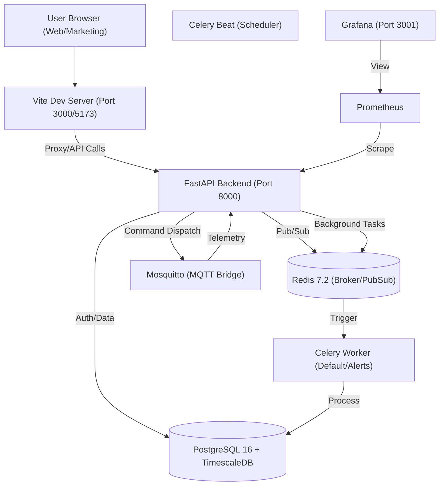

# Enterprise Engineering Handoff Snapshot

> [!IMPORTANT]
> This document preserves the final deterministic state of the Solar IoT Cold Storage Platform as of 2026-03-14. Use this as the primary context injection for subsequent AI sessions.

## 1. Pinned Tech Stack

### Backend (Python Core)
- **Language**: Python 3.12
- **Framework**: FastAPI 0.111.0 / Uvicorn 0.30.1
- **ORM/DB**: SQLAlchemy 2.0.31 (Async), Alembic 1.13.2, TimescaleDB (PostgreSQL 16)
- **Task Queue**: Celery 5.4.0 (Redis 7.2 Broker)
- **Security**: python-jose (JWT), Passlib (Bcrypt), PyOTP (MFA)
- **IoT/SDK**: Paho-MQTT 2.1.0, Boto3 1.34.144

### Frontend (Admin Dashboard - /web)
- **Core**: React 19.2.0, Vite 7.3.1, TypeScript 5.9.3
- **State/Data**: Zustand 5.0.11, TanStack Query v5
- **UI/Styling**: Tailwind CSS 3.4.17, Lucide Icons 0.577.0
- **Mapping**: Leaflet 1.9.4, React-Leaflet 5.0.0

### Marketing Site (/marketing-site)
- **Core**: React 19.2.4, Vite 8.0.0, Tailwind CSS 4.2.1
- **Animation**: Framer Motion 12.36.0

---

## 2. Directory Architecture

```text
/ (Project Root)
├── backend/                # FastAPI Application
│   ├── app/
│   │   ├── api/v1/         # Route definitions (auth, devices, stream, etc.)
│   │   ├── auth/           # JWT, RBAC, Security logic
│   │   ├── models/         # SQLAlchemy ORM Models
│   │   ├── schemas/        # Pydantic validation schemas
│   │   ├── services/       # Business logic (StreamManager)
│   │   ├── workers/        # Celery tasks (ingest, ota_publisher)
│   │   └── main.py         # Application Entrypoint
│   └── simulate_device.py  # IoT Telemetry Simulator
├── web/                    # Admin Dashboard (Vite/React)
│   ├── src/
│   │   ├── components/     # UI, Layout, Device components
│   │   ├── hooks/          # useDevices, useAuth
│   │   └── pages/          # MapPage, Dashboard, OTAPage
├── marketing-site/         # Public Facing Website
├── infra/                  # Terraform, Docker, Config files
├── docker-compose.yml      # Multi-container orchestration
└── walkthrough.md          # Implementation history
```

---

## 3. Infrastructure Topology



---

## 4. Data Flow & Event Logic

1.  **Telemetry Path**: IoT Devices (or `simulate_device.py`) publish JSON to MQTT -> `mqtt/client.py` (Bridge) consumes -> Dispatches `ingest_telemetry` Celery Task -> Written to TimescaleDB Hypertable (`sensor_readings`) + Published to Redis Channel.
2.  **Live Updates**: Redis `telemetry_stream` Channel -> `services/stream.py` (`StreamManager`) -> WebSocket Broadcast to connected Frontend clients (via `useDevices` hook).
3.  **OTA Flow**: Admin uploads firmware -> `admin/ota` API triggers `ota_publisher` task -> Generates S3 Presigned URL -> Broadcasts OTA Intent via MQTT to devices.

---

## 5. API Contracts (v1)

| Endpoint | Method | Purpose |
| :--- | :--- | :--- |
| `/auth/login` | POST | Authenticates user & returns JWT + MFA status |
| `/auth/mfa/setup` | POST | Generates TOTP secret and QR code |
| `/devices` | GET/POST | List and provision new IoT devices |
| `/readings/{id}/raw`| GET | Fetch historical time-series data |
| `/stream/telemetry` | WS | Real-time WebSocket telemetry stream |
| `/admin/ota` | POST/GET | Manage firmware releases and deployment |

---

## 6. State & Schema

### Active Models
- **`User` / `Organization`**: RBAC (Superadmin, Admin, Operator, Viewer).
- **`Device`**: Metadata, location (lat/lng), status (online/offline).
- **`SensorReading`**: Hypertable partitioned by `time`. Temperature, Humidity, Battery, Solar.
- **`Alert`**: Triggered on threshold violations (e.g., Temp > 8C).
- **`OTAUpdate` / `FirmwareRelease`**: Tracking version rollouts.

### Module Status
- [x] **Authentication**: JWT + RBAC + MFA.
- [x] **Real-time Map**: WebSocket-based fleet visualization.
- [x] **OTA Management**: Release creation and device status tracking.
- [x] **Telemetry Ingest**: TimescaleDB optimized pipeline.
- [/] **Audit Logging**: Implemented models, needs broader middleware integration.

---

## 7. Environmental Context

### Required `.env` Schema (Backend)
```env
ENVIRONMENT=development
SECRET_KEY=...
DATABASE_URL=postgresql+asyncpg://postgres:postgres_dev_password@db:5432/cold_storage_dev
REDIS_URL=redis://:redis_dev_password@redis:6379/0
MQTT_BROKER_HOST=mosquitto
JWT_ALGORITHM=HS256
# AWS Context (Production)
AWS_REGION=us-east-1
FIRMWARE_S3_BUCKET=...
```

---

## 8. Immediate Next Steps

1.  **Mobile App Verification**: Verify the `/android` build connects correctly to the local API via `192.168.1.8`.
2.  **Audit Log Middleware**: Standardize `AuditLog` entries for all `DELETE` and `PATCH` actions across the API.
3.  **Production Hardening**: Replace `SECRET_KEY` placeholders and transit to AWS Secrets Manager.

---

## 9. Machine-Readable State

```json
{
  "project_name": "Cold Storage Solar IoT",
  "handoff_timestamp": "2026-03-14T02:40:00Z",
  "status": "Healthy / Operational",
  "backend": {
    "engine": "FastAPI 0.111.0",
    "runtime": "Python 3.12",
    "db": "TimescaleDB 16",
    "workers": "Celery 5.4.0"
  },
  "frontend": {
    "dashboard": "React 19 + Vite 7",
    "marketing": "React 19 + Vite 8"
  },
  "connectivity": {
    "api_url": "http://localhost:8000",
    "dashboard_url": "http://localhost:3000",
    "marketing_url": "http://localhost:5173"
  },
  "last_fixed": [
    "Backend ImportError in v1/stream.py (decode_access_token name error)",
    "Frontend dev server restart (Port 3000/5173)",
    "Device simulation connectivity (MQTT -> DB)"
  ]
}
```

[VERIFIED & COMPLETE]
