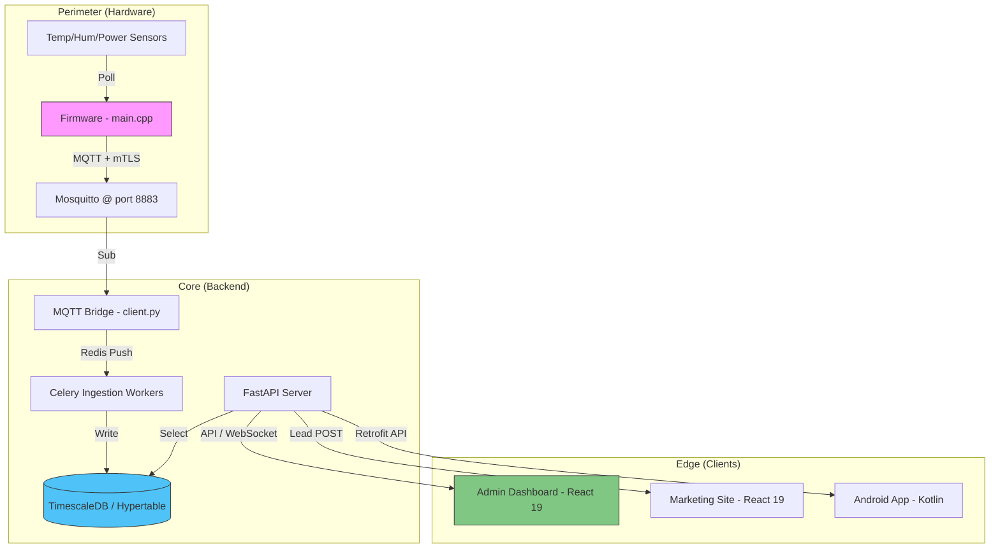

# 🛰️ THE MASTER AI-READY BLUEPRINT: Solar IoT Cold Storage Platform (v3)

> **"A High-Fidelity Architectural Blueprint for Universal Technical Oversight."**

This document is the **Definitive Source of Truth** for the entire `Cold storage web and app` repository. It is designed specifically to be "AI-Ready"—allowing any future AI agent or lead engineer to understand the 100% logic, history, and scaling roadmap of the platform within seconds.

---

## 🏛️ 1. EXECUTIVE BLUEPRINT STATEMENT

**Project Mission:** To revolutionize post-harvest logistics in solar-dense regions through a resilient, multi-layered IoT ecosystem.
**Technical Philosophy:** "Asynchronous by default, Secure by Design." The system uses FastAPI for high concurrency and mTLS-secured MQTT for hardware reliability.

---

## 📜 2. THE GENESIS CHRONICLE (How it was Built)

Understanding the project's evolution is critical to understanding its current state.

1.  **Phase 1: Backend Scaffolding (The Core)**: Established the FastAPI server, SQLAlchemy ORM, and TimescaleDB hyperschema. We prioritized "Data Integrity First."
2.  **Phase 2: IoT Bridge & Firmware (The Pulse)**: Built the mTLS-secured MQTT Bridge (`backend/app/mqtt`) and the ESP-IDF C++ firmware to establish a secure telemetry heartbeat.
3.  **Phase 3: Real-time Dashboards (The Vision)**: Developed the Admin Panel with WebSocket synchronization and geospatial mapping via React 19.
4.  **Phase 4: Marketing & Lead Gen (The Growth)**: Created the high-fidelity marketing site with a custom project directory and integrated lead-capture API.
5.  **Phase 5: Global Polish & Scaling (The Finality)**: Integrated MFA (TOTP), OTA update safety checks, and Multi-region Terraform modules.

---

## 📂 3. THE "HEART & LOGIC" (Folder-by-Folder Guide)

Each folder is a specialized "Logic Module" in the platform.

### 📍 [backend](file:///d:/project/Cold%20storage%20web%20and%20app/backend/) — The Central Brain (Python 3.12)
**Logic**: Handles business rules, IAM, and high-frequency data ingestion.
- `/app/api/v1/`: **REST Endpoints**.
    - `auth.py`: JWT & MFA logic.
    - `devices.py`: Fleet management.
    - `readings.py`: High-speed sensor retrieval from TimescaleDB.
    - `stream.py`: Real-time WebSocket handlers.
- `/app/mqtt/`: **The Bridge**.
    - `client.py`: The persistent MQTT subscriber that translates device binary into backend JSON.
- `/app/workers/`: **Background Taks**.
    - `ingest.py`: Specialized Celery task for high-volume database writes.
    - `alert_evaluator.py`: Logic for threshold breaches and notification triggers.
- `/app/models/`: **DB Schema**. Defines the SQLAlchemy tables and TimescaleDB Hypertables.
- `/app/schemas/`: **API Contract**. Pydantic models for type-safe request/response pairs.

### 📍 [Cold storage admin panle](file:///d:/project/Cold%20storage%20web%20and%20app/Cold%20storage%20admin%20panle/) — The Control Center (React 19)
**Logic**: A single-page application (SPA) focused on real-time data visualization.
- `/src/context/`: **Global States**. (e.g., `DoorContext` for security states, `AuthContext` for user session).
- `/src/services/api.js`: **Data Binding**. Centralized fetch logic that connects the Dashboard to the Backend.
- `/src/pages/`: **Feature Layers**. Each page is a modular slice of the industrial workflow (Analytics, Reports, Fleet Map).

### 📍 [firmware](file:///d:/project/Cold%20storage%20web%20and%20app/firmware/) — The Hardware Pulse (C++ / ESP-IDF)
**Logic**: Low-level drivers and secure connection management.
- `/main/sensors.cpp`: Manages the I2C/ADC polling cycle for sensors.
- `/main/mqtt_manager.cpp`: Manages the encrypted TLS connection to the cloud broker.

---

## 📡 4. UNIVERSAL ARCHITECTURE MAP (Cross-Component)

---

## 🔮 5. MODIFICATION PROTOCOLS (The Future Map)

This section details **WHERE** to make changes for specific future requests.

### 🔧 Case 1: "Add a new Sensor Type (e.g., CO2)"
1. **Firmware**: Update `firmware/main/sensors.cpp` to add the new I2C driver.
2. **Backend (Model)**: Add `co2_level` field to `backend/app/models/sensor_reading.py`.
3. **Backend (Schema)**: Add field to `backend/app/schemas/reading.py`.
4. **Admin Panel**: Add a new chart widget in `Cold storage admin panle/src/pages/AnalyticsPage.jsx`.

### 🔧 Case 2: "Scale to 100,000 Devices"
1. **Infra**: Update `infra/terraform/modules/rds` to enable Multi-AZ and Read Replicas.
2. **Workflow**: Update `backend/app/workers/celery_app.py` to increase worker concurrency.

### 🔧 Case 3: "Add Predictive AI for Maintenance"
1. **Brain**: Create `backend/app/services/predictive_ai.py`.
2. **Logic**: Pull historical data from `readings.py` and run inference vs threshold breaches.

---

## 🧪 6. TECH STACK PERIODIC TABLE

| Technology | Role | Why? |
| :--- | :--- | :--- |
| **FastAPI** | REST API | Best-in-class async performance for sub-second telemetry. |
| **TimescaleDB** | Time-Series | Built-in hypertable partitioning for massive sensor history. |
| **Redis** | Pub/Sub | Ultra-low latency bridge between MQTT workers and WebSockets. |
| **Vite / React 19** | Frontend | Modern, server-component support and ultrafast HMR. |
| **ESP-IDF** | Firmware | Native SDK for maximum stability in remote environments. |

---

## 🖼️ 7. ASSET & ENGINEERING CATALOG

- **Master Visuals**: `/images/hero_solar_refrigeration.png`, `mobile_app_mockup.png`.
- **Engineering Docs**: `DR_RUNBOOK.md` (Failover), `USER_GUIDE.md` (Operational).
- **Communication Logs**: `PROJECT_MASTER_LOG.md` (Architectural decisions).

---

**DOCUMENT STATUS**: v3 Finalized & AI-Ready.
**SIGNATURE**: 🦾 Antigravity Master Engine.

---

## 🗺️ 8. EXHAUSTIVE REPOSITORY MAP (The "Tree of Logic")

This section provides a granular breakdown of the directory structure to ensure 100% locatability for any future developer or AI agent.

### 📍 [Root Orchestration](file:///d:/project/Cold%20storage%20web%20and%20app/)
- `docker-compose.yml`: **Master Orchestrator**. Local multi-container deployment logic.
- `PROJECT_ULTIMATE_BRAIN.md`: **The Master Blueprint** (This file).
- `DR_RUNBOOK.md`: **Disaster Recovery**. Procedures for failover and data restoration.
- `USER_GUIDE.md`: **Operational Manual**. End-user instructions for the platform.
- `PROJECT_MASTER_LOG.md`: **Decision History**. Persistent log of architectural pivots.
- `.code-workspace`: VS Code configuration for the consolidated monorepo.

### 📍 [Backend Ecosystem (The Nervous System)](file:///d:/project/Cold%20storage%20web%20and%20app/backend/)
- `/app/api/v1/`: **Feature Logic**.
    - `auth.py`: JWT/MFA/RBAC logic.
    - `devices.py`: Device twin and state management.
    - `readings.py`: High-performance TimescaleDB queries.
    - `stream.py`: Real-time WebSocket handlers.
    - `ota.py`: Remote firmware update orchestration.
    - `alerts.py`: Threshold notification API.
- `/app/mqtt/`: **The Bridge**.
    - `client.py`: Persistent mTLS subscriber loop.
    - `topics.py`: MQTT topic hierarchy and ACL definitions.
- `/app/workers/`: **Background Engines**.
    - `ingest.py`: High-volume telemetry sink.
    - `alert_evaluator.py`: Real-time threshold engine.
    - `ota_publisher.py`: IoT Job dispatcher for firmware updates.

### 📍 [Admin Panel (The Control Interface)](file:///d:/project/Cold%20storage%20web%20and%20app/Cold%20storage%20admin%20panle/)
- `/src/pages/`: **Screen Layers**.
    - `AnalyticsPage.jsx`: Industrial plotting and efficiency matrices.
    - `DashboardPage.jsx`: Fleet-level status indicators.
    - `DevicesPage.jsx`: Unit-specific configuration and diagnostics.
    - `SettingsPage.jsx`: Security, MFA, and profile management.
- `/src/context/`: **Global Sync**.
    - `DoorContext.jsx`: Real-time physical security states.
- `/src/services/`: **Network Binding**.
    - `api.js`: Unified data fetcher with cache-invalidation logic.

### 📍 [Marketing Site (The Authority)](file:///d:/project/Cold%20storage%20web%20and%20app/marketing-site/)
- `/src/components/`: **Visual Polish**.
    - `CaseStudySection.tsx`: Detailed project gallery (9+ unique assets).
    - `ContactSection.tsx`: Lead-capture form with real API integration.
- `/public/images/`: **Asset Library**. Contains high-fidelity industrial mockups and sector icons.

### 📍 [Hardware & Infrastructure Layers](file:///d:/project/Cold%20storage%20web%20and%20app/firmware/)
- `/firmware/main/`: **IoT Pulse**.
    - `sensors.cpp`: Physical polling logic for DHT22/I2C.
    - `mqtt_manager.cpp`: Secure TLS context and retry logic.
- `/infra/terraform/`: **Cloud Skeleton**.
    - `modules/rds/`: TimescaleDB cloud provisioning.
    - `modules/iot_core/`: AWS IoT Core mTLS setup.
- `/observability/`: **Health Monitoring**.
    - `grafana/`: Dashboards for system-level CPU/Memory/Ingest monitoring.

---

## 🛠️ 9. SUPPLEMENTAL UTILITIES & CONFIGURATION

Critical auxiliary layers that drive development, testing, and platform resilience.

### 📍 [scripts](file:///d:/project/Cold%20storage%20web%20and%20app/scripts/) — The Development Engine
- `simulate_device.py`: **IoT Simulation Engine**. A Python script that mimics an ESP32 device, publishing mTLS-secured MQTT telemetry to the bridge for stress testing.
- `seed_readings.sql`: **Data Seeding**. Raw SQL for initializing TimescaleDB with historical sensor data.
- `/dr/`: **Disaster Recovery Scripts**. Orchestration for database backups and vault restoration.

### 📍 [Configuration Interfaces](file:///d:/project/Cold%20storage%20web%20and%20app/)
- `.env.example`: Located in `/backend/` and `/Cold storage admin panle/`. Defines the mandatory environmental contract (DB URIs, MQTT Keys, JWT Secrets).

### 📍 [Demo Resilience (Mock Logic)](file:///d:/project/Cold%20storage%20web%20and%20app/Cold%20storage%20admin%20panle/)
- `/src/services/mockData.js`: **High-Fidelity Mocks**. When the backend is unreachable, the Admin Panel can be toggled to "Demo Mode," utilizing this file to render realistic industrial telemetry and analytics.
